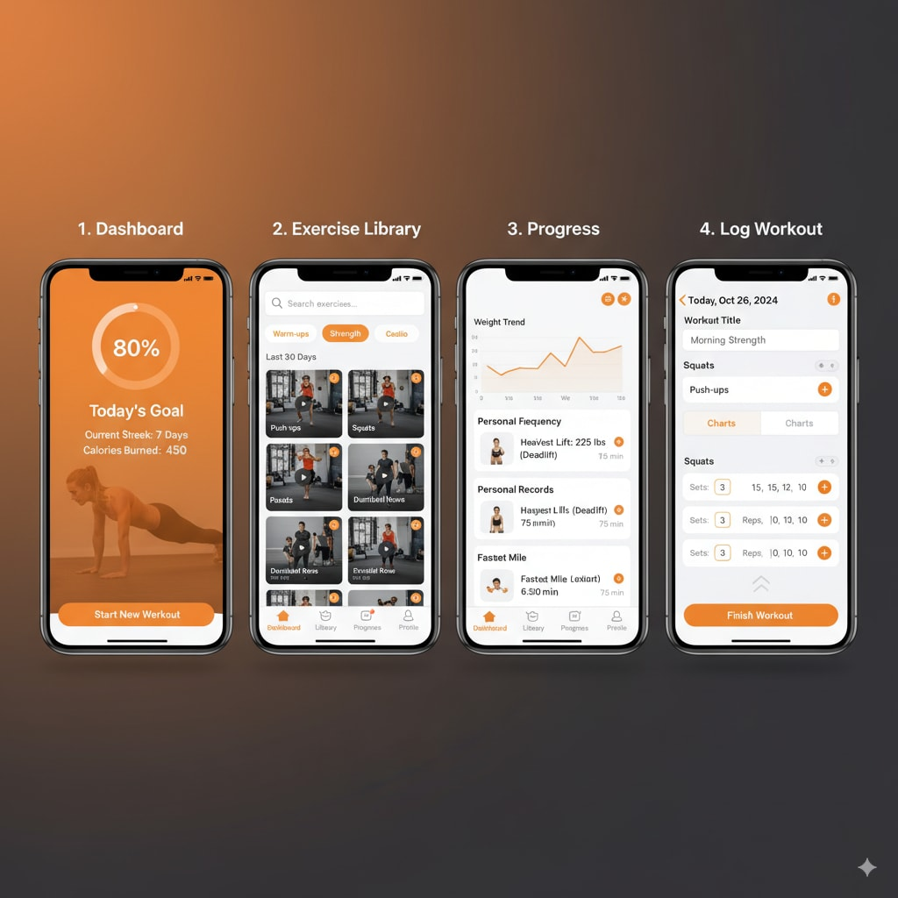

# How to use

Replcing following parts of `ios-mockup.md`

- \<Create a professional iOS app mockup figure\>
- \<APP SPECIFIC CUSTOMIZATION\>

## Examples



```text
<Create a professional iOS app mockup figure>
showing exactly 4 iPhone screens arranged horizontally in a single high-resolution image. The screens demonstrate a complete user journey for a Fitness tracker application.

<APP SPECIFIC CUSTOMIZATION>
Application Core: Personal fitness tracking and workout planning application with AI coaching
Primary Features:
1. Dashboard - Daily activity summary, calories burned, steps, heart rate
2. Workout Library - Exercise videos, custom routines, difficulty levels
3. Progress Charts - Weight trends, strength gains, body measurements over time
4. Activity Log - Workout history, personal records, achievement badges
Visual Theme: Energetic orange and black theme, bold sans-serif typography, high contrast design, motivational imagery with gradient accents
Target Audience: Health-conscious individuals aged 20-40
<END CUSTOMIZATION>
```
